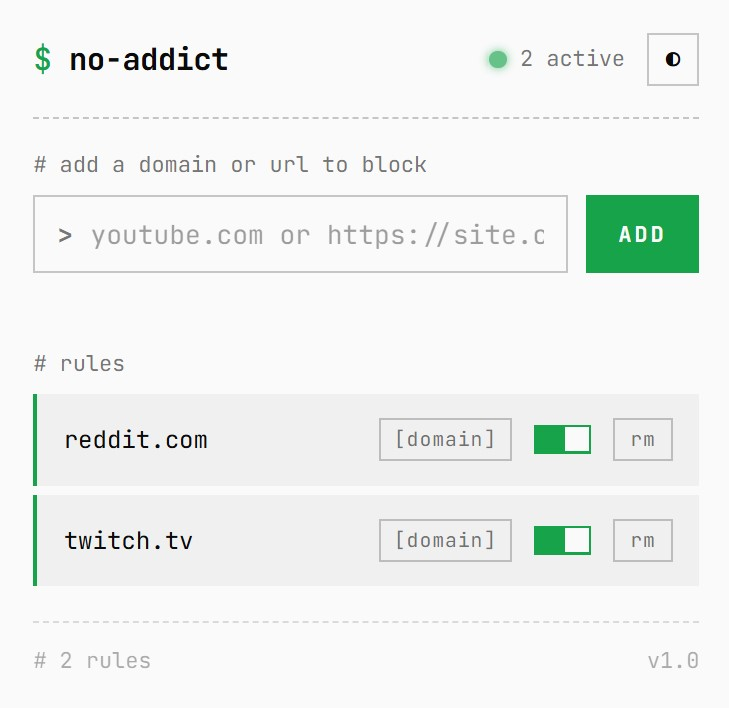
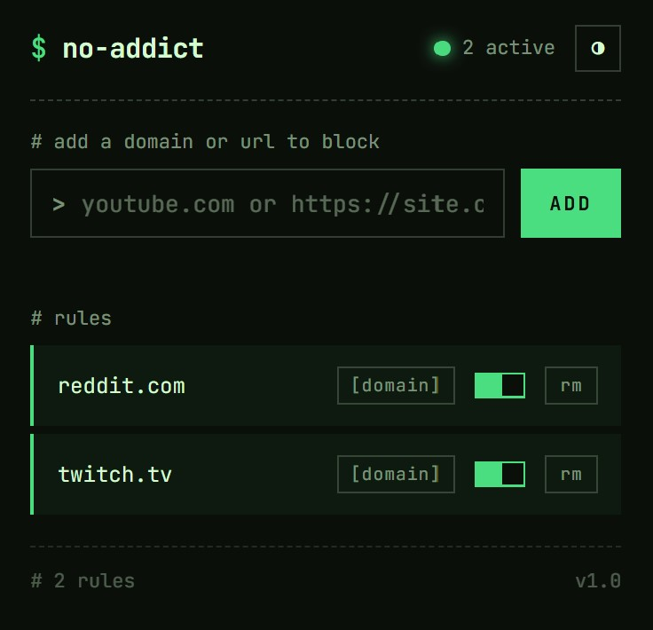

# No Addict

**No Addict** is a lightweight Chrome extension that helps users reduce digital distraction by blocking access to selected websites. Users can add domains or specific URLs they want to avoid, enable or disable blocking as needed, and automatically prevent those pages from loading by clearing their content.

The extension focuses on simplicity, persistence, and reliability, allowing users to control their browsing habits without intrusive restrictions.

---

## Screenshots

  
   
  <em>light mode</em>

 

  
   
  <em>dark mode</em>

---

## Development Tasks

### Core Functionality

- [x] Set up Chrome Extension (Manifest V3)
- [x] Create popup interface
- [x] Persist blocked rules using `chrome.storage.local`
- [x] Display list of blocked rules in popup

### Rule Management

- [x] Add new blocked rule from user input
- [x] Automatically detect domain vs full URL
- [x] Prevent duplicate rules
- [x] Enable / disable a rule using a toggle switch
- [x] Delete a blocked rule
- [x] Persist rule state across browser restarts

### Page Blocking

- [x] Load blocked rules in content script
- [x] Match current page against enabled rules
- [x] Block pages by removing or replacing page content
- [x] Ensure blocking runs before page content loads

### Reliability & Edge Cases

- [x] Handle `www` and non-`www` domains correctly
- [x] Ignore disabled rules
- [x] Safely handle empty rule lists
- [x] Support long URLs without errors

### Optional Enhancements

- [x] Dark mode support
- [ ] Temporary disable all rules
- [ ] Import / export blocked rules
- [ ] Confirmation before deleting a rule
- [x] Deal with SPAs
