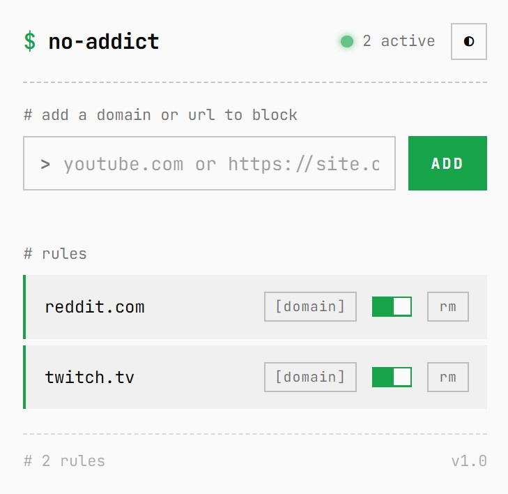
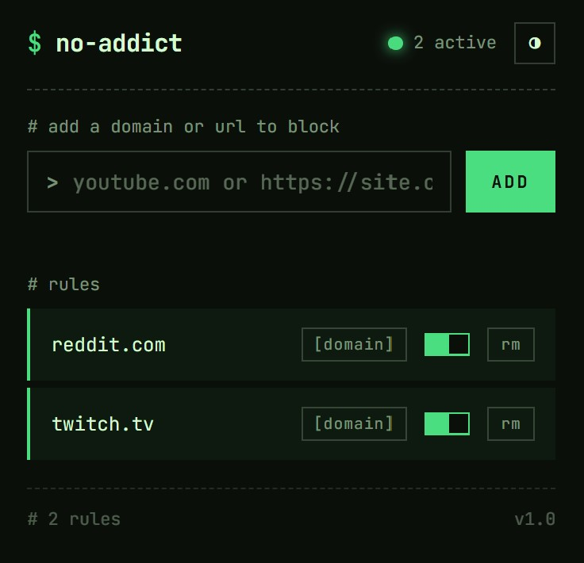
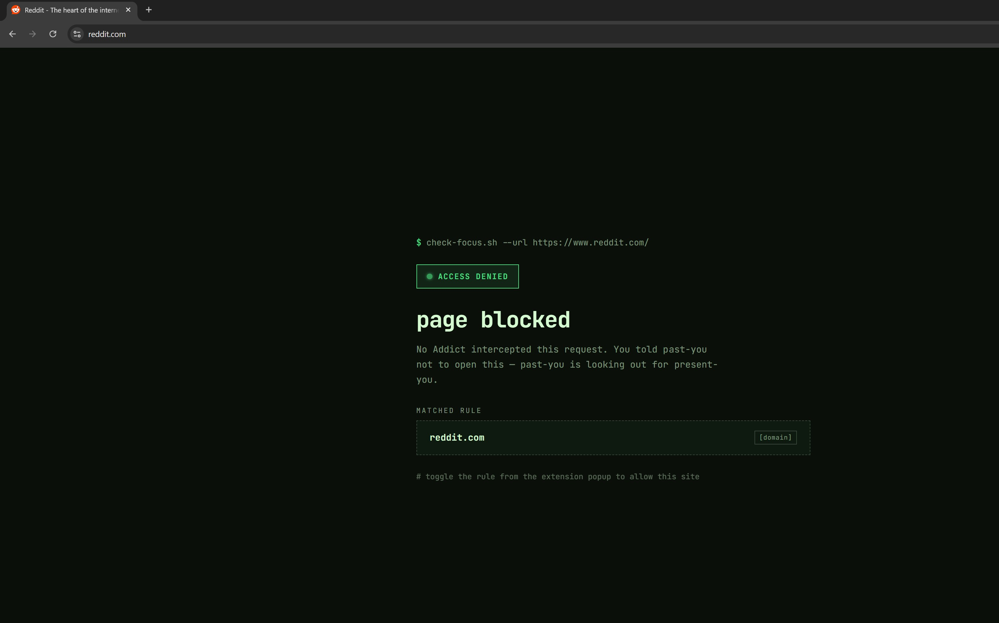

# no-addict

**A minimal Chrome extension that blocks distracting websites so you can stay focused.**

Add a domain or URL, toggle it on, and No Addict replaces that page with a clean terminal-style screen — no popups, no nags, just a hard stop.

---

## Screenshots

<p align="center">
  
  &nbsp;&nbsp;
  
</p>
<p align="center">

</p>

---

## Features

- **Block by domain or full URL** — `reddit.com` blocks the whole site; `https://reddit.com/r/all` blocks only that path
- **www-aware** — `reddit.com` and `www.reddit.com` are treated identically
- **Toggle without deleting** — disable a rule temporarily and re-enable it later
- **SPA-resilient** — a MutationObserver re-applies the block after client-side navigation rewrites the DOM
- **Theme-aware blocked page** — the full-page intercept screen inherits your chosen light or dark theme
- **Persistent** — rules and theme preference survive browser restarts via `chrome.storage.local`
- **No dependencies** — vanilla JS, no build step, no frameworks

---

## Installation

Chrome Web Store distribution is not set up yet. Load it unpacked:

1. Clone or download this repository
2. Open Chrome and go to `chrome://extensions`
3. Enable **Developer mode** (top-right toggle)
4. Click **Load unpacked** and select the repo folder
5. Click the puzzle-piece icon in the toolbar and pin **No Addict**

---

## Usage

| Action                | How                         |
| --------------------- | --------------------------- |
| Block a domain        | Type `reddit.com` → **Add** |
| Block a specific page | Type the full URL → **Add** |
| Pause a rule          | Toggle the switch off       |
| Remove a rule         | Click **rm**                |
| Switch theme          | Click the `◐ / ◑` button    |

---

## How it works

```
manifest.json
  └─ content_scripts/content.js   runs at document_start on every page
       └─ checks window.location against enabled rules in chrome.storage.local
            └─ match found → replaces body.innerHTML with the blocked-page UI

action/popup.html + popup.js      runs when the extension icon is clicked
  └─ reads/writes rules in chrome.storage.local
  └─ sends a "recheck" message to the active tab after any change
```

The content script runs **before** the page renders (`document_start`), so blocked pages never flash their content. A short-lived `MutationObserver` window handles SPAs that replace the DOM during hydration.

---

## Tech stack

|          |                                                    |
| -------- | -------------------------------------------------- |
| Runtime  | Chrome Extension Manifest V3                       |
| Language | Vanilla JavaScript (ES modules)                    |
| Storage  | `chrome.storage.local`                             |
| Fonts    | JetBrains Mono (bundled woff2, no network request) |
| Build    | None — load directly as unpacked extension         |

---

## Project structure

```
no-addict/
├── manifest.json
├── popup.html
├── popup.css
├── assets/
│   └── fonts/
│       └── jetbrains-mono-latin.woff2
└── scripts/
    ├── popup.js
    └── content.js
```

---

## Roadmap

- [ ] Temporary disable all rules (focus break timer)
- [ ] Import / export rules as JSON
- [ ] Confirmation dialog before deleting a rule
- [ ] Keyboard shortcut to open popup
